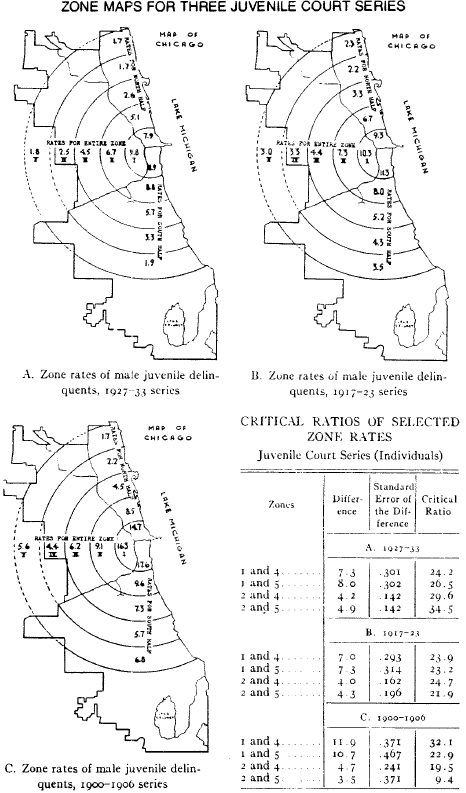

```{r setup, include = FALSE}
knitr::opts_chunk$set(echo=FALSE, warning = FALSE, message = FALSE, dev = "svg", fig.height = 5, dev.args=list(bg="transparent"))
```

class: inverse

# Questions

&nbsp;

--

* Where do you feel safe? Unsafe? Why?

--

   * What is a "bad neighborhood"?

--
   * Do you know places where people are likely to intervene? How do you know?

--
   * When would you intervene?
   
--

&nbsp;

* How has where you've lived affected your (mis)behaviour? 

   * What was temporary and what lasted?


---
class: inverse
# Social Ecology


## Some background information

<br>

> the study of the social and behavioural outcomes of the interaction between man and his environment (Wikström 2007)

<br>

Basic principle: Characteristics of the environment explain variation in crime not attributable to individual characteristics alone

---
# The Environment

*Everything external to the individual with which they come into contact*

--

.pull-left[
**Physical**

* Natural environment
   * e.g., landscape, flora, fauna
* Ambient environment
   * e.g., light, temperature
* Built environment
   * e.g., structures and spaces
]

--

.pull-right[
**Social**

* Social structure
   * e.g., norms, cohesion
* Social activities
   * e.g., monitoring, interventions
* Presence of others
   * e.g., bonds, "eyes on the street"
]


---
# Boudon—Coleman Boat

Most ecological theories focus on environmental causes and aggregate outcomes (macro-level), but crime happens in situations (micro-level)

--

The **Coleman** boat or **Boudon-Coleman** boat is used to illustrate causal mechanisms (arrows) linking micro (e.g., individual) and macro (e.g., neighborhood) variables<br>


---
# Boudon—Coleman Boat

We can apply the boat to the environment and crime:<br><br>


.text-center[

<br>*Micro-macro <strong>mechanisms</strong> are important for ecological theories—and must be compatible with basic facts about crime*

]

---
class:inverse

## Some boats at sea


---
class: inverse

# Explain to me:

&nbsp;

--

* Social disorganisation

   * What is it?
   * What causes it?
   * What does it cause?
   * What is the macro-micro model?

--

* What about collective efficacy?

   * How is it similar?
   * How does it differ?

--

* What about broken windows / the incivilities thesis?

---
class: inverse

# Some Example Projects


---
class: inverse, sncp

# The Seattle Neighborhoods and Crime Project


---
# Recall Theory

.image-75[

]

*Collective efficacy and broken windows disagree mostly about **A** and a bit about **B** and **E**.*

---

## The Experiments

Over 2000 person-hours of **field experiments**, conducted over four years, embedded in representative Seattle neighbourhoods with rich **ecological survey data** (2002-2003 SNCS)

* Balance strengths and weaknesses of experimental and observational methods

* Maximize internal and external validity


--


&zwj;1. **Lost Letter**: Collective efficacy &#8594; prosocial behaviour

&zwj;2. **Mailbox Experiment**: Disorder &#8594; crime

&zwj;3. **Littering Intervention**: Disorder &#8594; sanctioning

&zwj;4. **Litter Clean-Up**: Collective efficacy &#8594; disorder removal

---
# SNCS Experiments

.image-75[

]

* Embed experiments in disparate Seattle neighbourhoods
* Replicate and extend Keizer et al. and Sampson & Raudenbush


---
background-color: white

.image-tall[

]


---
background-color: white

.image-tall[

]

---
# Lost Letter Experiment

Collective efficacy is a capacity for **pro-social behavior**.

--

Therefore we can get a proxy measure using actual pro-social behavior.

--

Replication of [Milgram et al. (1965)](https://doi.org/10.1086/267344) and [Sampson (2012)](https://www.press.uchicago.edu/ucp/books/book/chicago/G/bo5514383.html).


--

2,938 letters were dropped on Seattle sidewalks for passersby to encounter.


--

24 letters—8 per addressee—were dropped in each census tract:
  * Charles F. Landers Sr. (Personal)
  * Friends of Black Lives Matter (BLM)
  * American Neo-Nazi Party (Nazi)


--

Mailed letters were received at a PO Box monitored by the research team.

Letters were numbered and geocoded to drop locations.

---

.image-tall[

]

---
# Lost Letter: Results

.smallish[

| *Study* (Letter Address)         | *Return Rate* | $\rho(CE)$ 
|:--------------------------------|--------|------------|
|*Milgram et al. (1965)*<sup>1</sup>         |        |            |
| &nbsp;&nbsp; Medical Research Associates    | 70%    |    --      |
| &nbsp;&nbsp; Friends of the Community Party | 70%    |    --      |
| &nbsp;&nbsp; Friends of the Nazi Party      | 25%    |    --      |
|*Sampson (2012)*<sup>2</sup>                | 33%    |    .41     |
|*SNCP* (2016)<sup>3</sup>                          |        |            |
| &nbsp;&nbsp; Charles F. Landers Sr.         | 79%    |    .35     |
| &nbsp;&nbsp; Friends of Black Lives Matter  | 71%    |    .32     |
| &nbsp;&nbsp; American Neo-Nazi Party        | 24%    |    .03     |

* Our results closely mimic Milgram et al. (1965).
* Collective efficacy does not predict Neo-Nazi letter returns.
]


.footnote[
[1] New Haven, CT; [2] Chicago, IL; [3] Seattle, WA
]


---
# Mailbox: Model

Objective: Causal test of direct effect of disorder on crime (A).

<br>

.image-62[

]

---

# Mailbox: Method

.pull-left[
.image-full[

]
]


* A letter containing a visible $5 bill is left near mailbox for passersby to encounter.


--

* Litter and a sign board with graffiti are introduced to manipulate disorder.


--

* Researchers record whether participants mail, steal, or ignore the envelope.<sup>1</sup>

.footnote[[1] Perceived sex, age, and group size of participants were also recorded to adjust for compositional differences of tracts.]

--

* We conducted 405 trials with 3,671 participants in 20 Seattle neighbourhoods.

---
# Mailbox: Model

Objective: Causal test of direct effect of disorder on crime (A).

<br>

.image-62[

]


---

# Mailbox: Model

* Measure causal effect of disorder on crime and prosocial behaviour
* Measure association of collective efficacy with crime and prosocial behaviour
<br>

.image-75[

]


---

# Mailbox: Results


<table style="width:70%">
  <tr>
    <td style="font-size:115%" colspan="5">Mailbox: Participant Actions</td>
  </tr>
  <tr>
    <th>Condition</th>
    <th>Walk-By</th>
    <th>Mail</th>
    <th>Theft</th>
  </tr>
  <tr>
    <td rowspan="2">Control</td>
    <td>1629</td>
    <td>208</td>
    <td>33</td>
  </tr>
  <tr>
    <td>87.1%</td>
    <td><strong>11.1%</strong></td>
    <td><strong>1.8%</strong></td>
  </tr>
  <tr>
    <td rowspan="2">Treatment</td>
    <td>1637</td>
    <td>136</td>
    <td>28</td>
  </tr>
  <tr>
    <td>90.9%</td>
    <td><strong>7.6%</strong></td>
    <td><strong>1.6%</strong></td>
  </tr>
</table>

Key Findings:

* Disorder has no impact on theft.


--

* Disorder reduces the likelihood of mailing—resulting in the letter remaining on the ground longer.


--

* Collective efficacy is associated with lower theft, but not more mailing.

.text-center[
*We fail to replicate Keizer et al. (2008)*
]


---

# The Littering Intervention


&zwj;Objective: Causal test of direct effect of disorder on sanctioning (B).

&nbsp;

.image-62[

]


---

## Littering Intervention: Method

A confederate walks down the street and flagrantly litters in view of passersby near a trash can with a no-littering sign.<sup>1</sup>

.footnote[[1] Or perhaps hits their dog with garbage.
<br>
]

--

Researchers record if confederate is sanctioned—**risky prosocial behavior**—or litter disposed of by participant—**low-risk prosocial behavior**. *Content* of sanction is also recorded.

--

Litter and a sign board with graffiti are introduced to manipulate disorder.

--

Replicated with three confederates of varying gender and race to manipulate interpersonal context which may influence evaluations of risk:<sup>2</sup>
   * Black Man
   * White Man
   * White Woman

.footnote[[2] Gender and race also relate to normative expectations.]

--

We conducted 576 trials in 12 Seattle census tracts.

???

8 trials per person per condition in 12 tracts. 8 x 2 x 3 x 12

---

# Littering Intervention: Model

.pull-left[

]

.pull-right[
* Test of direct effect of disorder on sanctioning (B).
]

---
count: false

# Littering Intervention: Model

.pull-left[

]

.pull-right[
* Test of direct effect of disorder on sanctioning (B).

* Norm-Violation is *fixed*—all relationships are conditional on the offense occurring.
]

---
count:false

# Littering Intervention: Model

.pull-left[

]

.pull-right[
* Test of direct effect of disorder on sanctioning (B).

* Norm-Violation is *fixed*—all relationships are conditional on the offense occurring.

* Test effect of interpersonal context of norm violation on sanctioning (L).
]

---
count:false

# Littering Intervention: Model

.pull-left[

]

.pull-right[
* Test of direct effect of disorder on sanctioning (B).

* Norm-Violation is *fixed*—all relationships are conditional on the offense occurring.

* Test effect of interpersonal context of norm violation on sanctioning (L).

* Captures association between collective efficacy and sanctioning (M).
]

---

# Results: Sanctions

<table style="width:70%">
  <tr>
    <th><br>Condition</th>
    <th>Black<br>Man</th>
    <th>White<br>Man</th>
    <th>White<br>Woman</th>
    <th><br>All</th>
  </tr>
  <tr>
    <td rowspan="2">Control</td>
    <td>2</td>
    <td>2</td>
    <td>9</td>
    <td>13</td>  
  </tr>
  <tr>
    <td><strong>.021</strong></td>
    <td><strong>.021</strong></td>
    <td><strong>.103</strong></td>
    <td>.045</td>
  </tr>
  <tr>
    <td rowspan="2">Treatment</td>
    <td>1</td>
    <td>8</td>
    <td>4</td>
    <td>13</td> 
  </tr>
  <tr>
    <td><strong>.011</strong></td>
    <td><strong>.091</strong></td>
    <td><strong>.043</strong></td>
    <td>.045</td>
  </tr>
  <tr>
    <td rowspan="2">Both</td>
    <td>3</td>
    <td>10</td>
    <td>13</td>
    <td>26</td>
  </tr>
  <tr>
    <td>.016</td>
    <td>.052</td>
    <td>.068</td>
    <td>.045</td>
  </tr>
</table>


* Effect of disorder on sanctions—a risky prosocial action--is *conditional* on confederate race/gender.

--
* Collective efficacy and letter returns did not predict sanctioning (M).

--
* Sanctioning varies widely by confederate in both *quantity* and *content*.
   * White woman: *Confrontational* sanctions usually from men.
   * Black man: *Non-confrontational* sanctions only from women.
   * White man: *Non-confrontational* sanctions, men and women.


---

# Results: Throwing Away


<table style="width:70%">
  <tr>
    <th><br>Condition</th>
    <th>Black<br>Male</th>
    <th>White<br>Male</th>
    <th>White<br>Female</th>
    <th><br>All</th>
  </tr>
  <tr>
    <td rowspan="2">Control</td>
    <td>3</td>
    <td>7</td>
    <td>7</td>
    <td>17</td>  
  </tr>
  <tr>
    <td><strong>.032</strong></td>
    <td>.079</td>
    <td>.079</td>
    <td><strong>.059</strong></td>
  </tr>
  <tr>
    <td rowspan="2">Treatment</td>
    <td>3</td>
    <td>3</td>
    <td>4</td>
    <td>10</td> 
  </tr>
  <tr>
    <td><strong>.032</strong></td>
    <td>.032</td>
    <td>.043</td>
    <td><strong>.035</strong></td>
  </tr>
  <tr>
    <td rowspan="2">Both</td>
    <td>6</td>
    <td>10</td>
    <td>11</td>
    <td>27</td>
  </tr>
  <tr>
    <td>.032</td>
    <td>.052</td>
    <td>.057</td>
    <td>.047</td>
  </tr>
</table>

We also evaluated if our interventions impacted throwing away the dropped litter—a low risk, non-confrontational prosocial action.

--

* Disorder treatment reduces throwing away.

    * This effect also conditional on confederate characteristics.
--

* Collective efficacy and letter returns do not predict throwing away.

---

# Litter Clean-Up


&zwj;Objective: Observational examination of association between social control and disorder clean-up (D).

&nbsp;

.image-62[

]

---

# Litter Clean-Up: Method

.pull-left[
.image-full[

]
]

.pull-right[
* A variety of trash is dropped on a sidewalk.


]


---
count: false

# Litter Clean-Up: Method

.pull-left[
.image-full[

]
]

.pull-right[
* A variety of trash is dropped on a sidewalk.

* A magazine rack with concealed camera and motion detector records when the litter is cleaned up and how many people pass by.
]

---
count: false

# Litter Clean-Up: Method

.pull-left[
.image-full[

]
]

.pull-right[
* A variety of trash is dropped on a sidewalk.

* A magazine rack with concealed camera and motion detector records when the litter is cleaned up and how many people pass by.
   * This permits capturing the relationship between collective efficacy and time to remove disorder.


]

---
count: false

# Litter Clean-Up: Method

.pull-left[
.image-full[

]
]

.pull-right[
* A variety of trash is dropped on a sidewalk.

* A magazine rack with concealed camera and motion detector records when the litter is cleaned up and how many people pass by.
   * This permits capturing the relationship between collective efficacy and time to remove disorder.


* An alternate magazine rack defaced by graffiti and stickers is swapped in to manipulate disorder.
]

---
# Monitoring System

.pull-left[
.image-full[

]
]
.pull-right[
.image-full[

]
]


---
# Disorder Condition

.image-full[

]


---

# Litter Clean-Up: Results

.pull-left[
.image-full[

]
]

* The experiment was abandoned after a small number of trials.

---
count: false

# Litter Clean-Up: Results

.pull-left[
.image-full[

]
]

* The experiment was abandoned after a small number of trials.

* In Ravenna, residents reported the magazine racks on Nextdoor as an "eyesore".

--

* Two magazine racks had locks cut and were removed.


--

* Thus we were unable to continue experiment *because of high collective efficacy* in Ravenna.

--

* In contrast, one rack was left undisturbed *for an entire year* in Capitol Hill (low collective efficacy).


---
class: inverse

# Some Other Examples

---

## Development of *Neighborhoods*

.image-full[

]


---

## Development of *Neighborhoods*

&nbsp;

.image-75[

]

---
## New Influences

.image-full[

]

---
## New Influences


---
## Developmental vs. Situational

.image-full[

]

---
## Developmental vs. Situational

&nbsp;

.image-75[

]


---
## Macro-Ecology

&nbsp;

.image-75[

]

---
## Macro-Ecology

&nbsp;

.image-90[

]


---
class: inverse

# Questions

&nbsp;


--

* Can (and should) informal controls replace formal controls such as policing? When?
   * What are the *risks* and *benefits*?

--

&nbsp;


* Is crime more the result of development (e.g., socialization) or context (i.e., situations)?
   * How well can these be distinguished?


--

&nbsp;


* How do these theories relate to larger macro-processes? 
   * How about to justice?


---
class: inverse
# Wrap-Up

* Social ecological theories focus on human-environment interaction

* Sociological perspective emphasises social control

* Micro-macro mechanisms are the theoretical and empirical frontier 


---
count: false

# Appendix

---
count: false
class: inverse

# Classical Crime Ecology

### The social cntrol perspective

&nbsp;

> In the most fundamental terms, "social control" referred to the capacity of a society to regulate itself according to desired principles and values. (Janowitz 1975:82)

---
count: false

# The Chicago School

Context at the start of the 20th century:

* Dominance of individualistic theories

   + Evolutionary and biological
   + Mental deficiency

--

* Neglect of changing conditions of life

   + Urbanization
   * Industrialization and technological change
   + Mass migration and immigration
   + Inner city poverty and despair (e.g. Sinclair's *The Jungle*)

---
count: false

## A new approach to social science

* Apply principles of natural ecology to urban processes

   + Competition among groups
   + Niches in "natural places"
   + Behaviour from social structure and environment, not genetics and traits

--

* Methodology

   + Ethnography and life histories
   + Ecological analysis
   + The city as a laboratory: The Chicago Area Project

--

* Major theoretical contributions

   + Symbolic interactionism
   + Differential association
   + **Social disorganization**

---
count: false

# Social Disorganization


---
count: false

## Big Data + Mixed Methods

.pull-left-60[
* Court, truancy, and crime records

   + Spatial analysis of delinquent residences
      * *Location of **delinquents** not **crimes***
   + Sociodemographic data
   + Early network analysis

* Interviews with delinquents

   + Life histories
   + Self-perceptions
   + Roles of peers and older delinquents
]
.pull-right-40[

]

---
count: false

## Shaw & McKay's Observations

.pull-left-60[
* More delinquents in "zone in transition"

   + High **population turnover**, ethnic **heterogeneity**, and **poverty**
   + Age-spanning **delinquent tradition** competing with conventional values
   + Crime high and delinquent groups stable *despite ethnic turnover*

* Few delinquents in peripheral areas

   + Stable, homogeneous, middle and upper class population
   + Isolated delinquency; no delinquent tradition
   + Ethnic groups moving outward *exhibited low crime rates*
]
.pull-right-40[

]

--

.text-center[
*How do we make sense of this?*
]

---
count: false

## Social Disorganization Theory

**Social disorganization** is the inability of community to **solve problems collectively** or **achieve collective values**

* Weak and unlinked institutions with no sense of community
* Produces myriad social ills including delinquency
* Theory of **delinquency** rather than of **delinquent acts**

<br>


---
count: false

## Causes

* **Poor economic conditions**

   + Reduced conventional opportunities
   + Lack of resources to address problems
   + Reliance on illegal or quasi-legal income

--


* **Residential instability**

   + Constant disruption of institutions
   + Impermanence reduces sense of community

--


* **Ethnic/racial heterogeneity**

   + Different norms and values (or at least perception of such)
   + Communication barriers
   + Shift to urban living

---
count: false

## **Place** not race!

*Racial differences in delinquency are due primarily to location of residence.*

> ... it cannot be said that [black delinquency rates] are higher than rates for white boys in comparable areas, since it is impossible to reproduce in white communities the circumstances under which Negro children live... **it would not be possible to reproduce the effects of segregation and the barriers to upward mobility.** (xxix)

<br>

> Clearly, **one must beware of attaching social and economic significance to race or nativity.** For, in the present social and economic system, it is the Negroes and the foreign born, or at least the newest immigrants, who have least access to the necessities of life and who are therefore least prepared for the competitive struggle. It is they who are **forced to live in the worst slum areas and who are least able to organize against the effects of such living.** (155)

---
count: false

## Social Disorganization Theory

<br>


 

---
count: false

## Mechanisms

*Rich social explanation derived from court records and life histories*

.pull-left[
**Loss of Control Over Youth**

* *The direct effect of social disorganization on delinquency*
* Loss of informal social control

    + Parental supervision
    + Community controls

* Spontaneous, unsupervised play groups of children
]

--

.pull-right[
**Cultural Transmission**

* *The indirect effect of social disorganization on delinquency*
* Delinquent tradition transmitted across generations of youth

   * Older gangs transmit delinquency to younger play groups
   * Transmission is **learning** of a culture

* Delinquent traditions make high delinquency rate persistent 
]


---
count: false
class: inverse

# Collective Efficacy

.pull-left[
.image-full[

]
]

.pull-right[
.image-full[

]
]

---
count: false

## Collective Efficacy

"The linkage of mutual trust and the willingness to intervene for the common good" (Sampson)


* Merges *control-based social disorganization*<sup>1</sup> with social capital theories

.footnote[[1] See Kornhauser (1978) and Sampson & Groves (1989)]

--

* A neighborhood **capacity to achieve an intended effect**

   * e.g., maintaining public order
   * Mechanisms: 
      * Primary: Social control actions—informal *and* formal
      * Secondary: Socialisation


--

* Collective efficacy inhibited by...

   * **Heterogeneity** through realization of common values
   * **Disadvantage** through deprivation of resources
   * **Residential instability** through disruption of social ties

---
count: false

## Collective Efficacy and Crime

<br>

.image-90[

]

---
count: false

### Collective efficacy vs. social disorganization

>  ‘[Collective efficacy] accepts the basic idea of Social
Disorganization theory that social control is a collective
challenge not attributable to the characteristics of individuals
alone and that it constitutes a major source of variation in
crime rates (Sampson 2012)

&nbsp;

> ‘[Collective efficacy] relaxe[s] the traditional
disorganization assumption that the ideal contextual setting for
social control is necessarily one characterized by dense,
intimate, and strong neighbourhood ties (e.g., through friends
or kin) (Sampson 2012)

&nbsp;

Another key difference: *Focus on control of crime rather than criminality*

* No explicit theory of development

---
count: false

## Status

.pull-left[
.image-100[

]
]
.pull-right[

&zwj;Evidence:

* Support in USA and internationally
* Stronger in cross-section than longitudinal

&zwj;Future work:

* Mechanisms
   * Developmental
   * Situational
* Interventions
]
