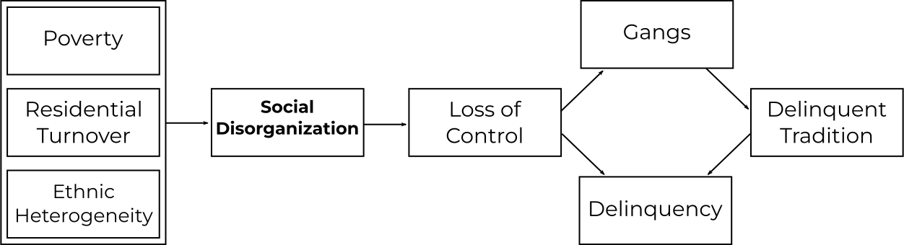
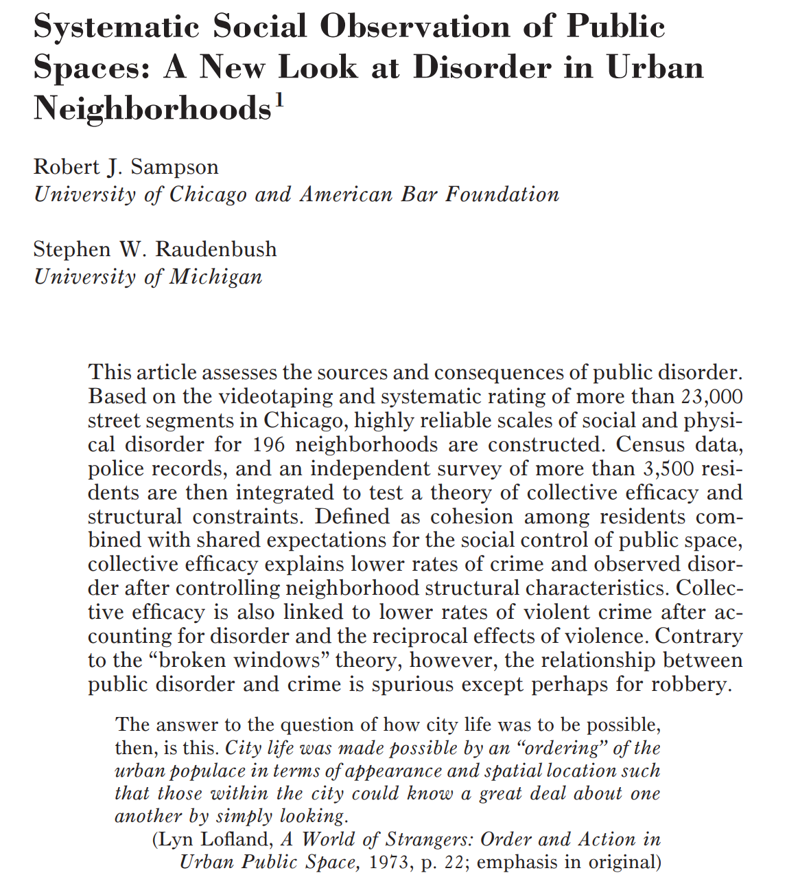
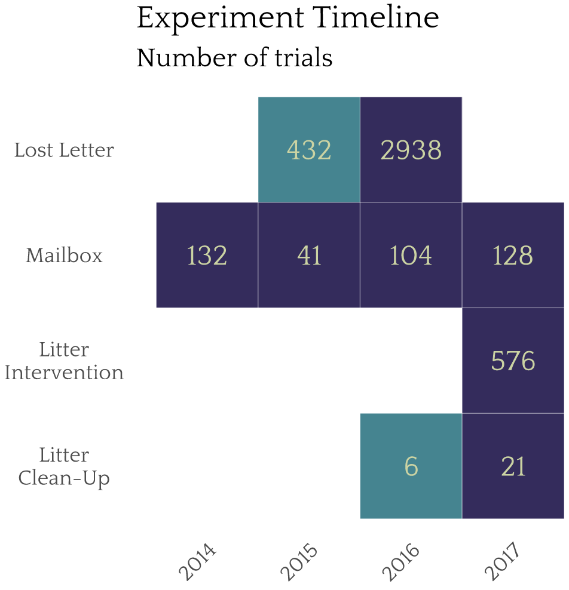
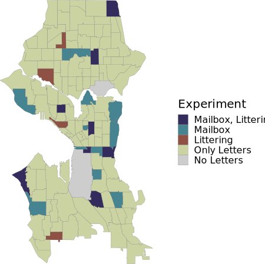
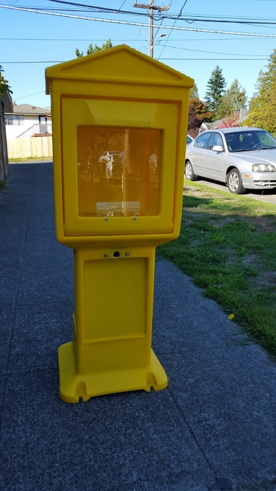
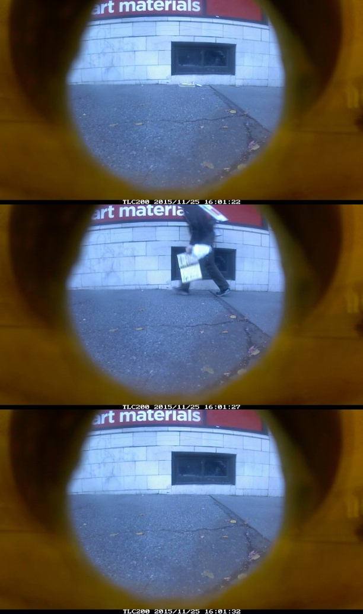

```{r setup, include = FALSE}
knitr::opts_chunk$set(echo=FALSE, warning = FALSE, message = FALSE, dev = "svg", fig.height = 5, dev.args=list(bg="transparent"))
library(tidyverse)
```


# Overview

* **Social Control**

* **Broken Windows**

   * Order maintenance policing
   * Disorder remediation
   
* **Collective Efficacy**

   * Social capital and expectations for control
   * Lost letter experiment

* **Broken Windows and Collective Efficacy**

   * Sampson & Raudenbush (1999) and Keizer et al. (2008)
   * Mailbox experiment
   * Litter clean-up experiment
   * The offender perspective
   * Collective efficacy and the built environment


???

Today we'll go over two key theories of informal social control: Broken Windows and Collective Efficacy

These theories are partly in opposition, so I'll also discuss the debate between them

In doing so, I'll talk about key research from some major authors as well as my own work as this is my primary area of research


---
# Social Control

Janowitz (1975): Classic social control is "the capacity of a social group to regulate itself"


???

The theories I'll be talking about today are community theories of informal social control. You've likely heard a lot about social control already.

In Sociology and Criminology, the classic concept of social control is about groups regulating the behavior of their members. 

--

&zwj;Example: 

**Social disorganization** (Shaw & McKay 1942) is the inability of community to **solve problems collectively** or **achieve collective values**

<br>



???

The most famous example of this is Shaw & McKay's social disorganization theory---originally formulated to describe conditions in Chicago in the early 1900s---which describes how neighborhood disadvantage and instability make it difficult for residents to exert social control over youth, resulting in the emergence of gangs and a stable delinquent tradition.

---
count: false

# Social Control

Janowitz (1975): Classic social control is "the capacity of a social group to regulate itself"


<br>

Forms of social control:

.pull-left[

Basic distinction:

* **Informal**
* Formal

]

???

Since Shaw & McKay, work on community social control has expanded to consider different forms of control.

The most common distinction is between formal control---that based on formal legal penalties and administered by authorities like the police---and informal control---that used by those without formal legal sanctions, such as family, neighbors, employers, and angry locals out on the street.

--

.pull-right[

Hunter's (1985) levels:

* Private
* **Parochial**
* **Public**

]

???

Another common distinction is based on Hunter's levels of control, which distinguish between private, parochial, and public control. Private is control that occurs through close personal relationships like parents and friends---the core stuff of Hirschi's social bond control theory.

Parochial control is based on loose social networks operating through the community and local institutions like school, church, businesses, and community groups---this can include those angry locals on the street.

Public focuses on the ability of communities to access public goods and services to maintain order, including but not limited to police.

In Hunter's scheme, these levels of control support each other---social control is most effective when all three are strong and it is hard for a single one to do the complete job.

The theories we're focusing on today are primarily concerned with informal social control, particularly parochial and public control.

---

# Broken Windows


&#8203;Observation: Serious crime is more common in neighbourhoods with disorder or "incivilities"

???

The first of these theories is broken windows, which begins with a simple observation


Physical and social disorder

   * Physical: Graffiti, litter, dilapidated or abandoned buildings
   * Social: Public intoxication, panhandling, prostitution

--

&#8203;Proposition: [Wilson & Kelling's (1982)](https://www.theatlantic.com/magazine/archive/1982/03/broken-windows/304465/) "Broken Windows"

.pull-left-60[
* People interpret disorder as a sign of low social control
   
* Offenders thus more likely to commit crime (low deterrence)

* Non-offenders thus believe victimization is more likely, so they keep to themselves, reducing real social control
]

.pull-right-40[

]

???

If no one stops littering or pan-handling, you might infer that no one will stop robbery or drug dealing either

If you're considering offending and think no one will stop you, you'll be more likely to commit crime

If you're worried about crime, you'll think you're more likely to be victimized, so you stay at home more, avoid going out at night---and if everyone does that, no one is around to stop anyone from committing crime

 
--

.text-center[
**Broken Windows Thesis**: *At the neighbourhood level, disorder **causes** crime*
]

???

Therefore...

---

# Broken Windows


.pull-left-60[


]

.pull-right-40[
* **A**: Disorder signals low guardianship which increases offending

* **B**, **E**: Disorder and crime constrain social relations and impede control

* **C**, **D**: Social control inhibits both disorder and crime
]

???

We can diagram this theory.

The direct path A is based on deterrence. Potential offenders see no one intervenes against minor deviance, assume they can get away with more serious things. It is an escalation argument as well--presence of minor violations gives way to more serious ones. Folks in policy and policing mainly paid attention to this direct effect.

The indirect mechanism here is simple informal social control. Disorder means fewer eyes on street, people moving out, and reduced willingness to intervene. This pathway was neglected in research, literature, and policy until fairly recently.


--

* Key Idea: Disorder is not *individually* harmful but it *accumulates*

   * Intervene when problem is still small
   * Intervene where problems overwhelm community social control

.text-center[
*A theoretical basis for **order maintenance policing***
]

???

Wilson & Kelling describe this as a conundrum: Individual incivilities are minor and do not directly harm individuals, so it seems unjust to invoke the police. But when they are pervasive, the harm can be substantial. They advocated for something like community policing---helping locals enforce norms. But what policymakers and police ran with was that they should aggressively police disorder.

---
# Order Maintenance Policing

* Residents worry more about pervasive disorder than major crimes

   * **Goal**: Stabilize informal control by reducing fear (indirect path)
   * **Assumption**: Consensus on disorder
   
???

Surveys and interviews indicate residents often express more worry about non-criminal disorder than they do serious crime, likely in part because it is much more frequently encountered; order-maintenance policing focuses on this disorder in hope reducing it increases social control of crime in general.

Wilson & Kelling acknowledge that there are places with little disorder or crime and no need for police as a result--they alrady have effective social control. To them, police are about bolstering informal control, not replacing it.

One assumption built into this approach is that people agree on what disorder is; Wilson & Kelling advocated for enforcing neighborhood norms but most implementations imposed outside standards on communities.

--

* Targeting disorder with policing (deterrence)

   * High certainty
   * Minor penalties
   * **Mechanism**: Deter offenders (direct path)

???

Basic idea behind order maintenance policing is massively increasing certainty but not being severe in penalties---focus on warnings and small fines. One problem is that even what look like small fines really add up. There's a large literature now on consequences of fines---known as legal financial obligations. Constant police contacts also erode relations with the community.

--

.pull-left-70[

* Classic example: New York under Bill Bratton and Rudy Giuliani

   * "Quality-of-life" offenses
       * Fare evasion, public drinking, graffiti
   * Stop-and-frisk

]
.pull-right-30[

]

???

These policies were first made big in the public eye in the early 1990s by New York City police chief Bill Bratton under mayor Rudy Giuliani (seen on the right). Police focused on quality-of-life offenses like fare evasion, drinking, and graffiti. Stop-and-frisk went big too. Giuliani supposedly fired him during his first term because he was upset Bratton was getting credit for New York's huge crime decline---which most scholars agree was unrelated to order maintenance policing.

---
# Evidence for Policing Disorder

* [Crime (Braga et al. 2015)](https://doi.org/10.1177/0022427815576576)

   * Modest effects on crime
   * Aggressive order maintenance works poorly
   * Targeting specific places more effective (i.e., hot spots)

???

Speaking of which, evidence for order maintenance or disorder policing reducing crime is pretty weak

Order maintenance doesn't show much crime reduction except where it is implemented as a hot spots strategy. This suggests the effects are less about reducing disorder than about deterrence due to police being around and the resulting increased likelihood of apprehension

--

* [Fear of Crime (Weisburd et al. 2015)](https://doi.org/10.1177/0022427815577837)

   * No evidence for reduction of fear of crime
   * No evidence for improved informal social control

???

There's also not much evidence for order maintenance policing reducing fear of crime or increasing social control capacity---so it doesn't appear to accomplish the primary goal.

--

* Iatrogenic consequences

   * Alienating communities from police
   * Increased racial disparities in stops, arrests, and fines
   * Criminalization of homelessness and mental illness

???

It also has negative consequences, such as...

An important thing to note, however, is that if your intended goal is reducing disorder itself, targeting disorder may effectively do that... but the important counterfactual is whether some other strategy might work better (or if it might work best in conjunction with other strategies)


---
# Fixing Broken Windows

*Rather than punish broken windows, why not repair them?*<sup>1</sup>

.footnote[[1] Review: Kondo et al. (2018) "Neighborhood Interventions to Reduce Violence"]

???

Here's one example of an alternative strategy.

It may be symptomatic of the American perspective on crime, but it is remarkable we latched entirely on to punishing our way out of broken windows rather than trying to fix them.

Unlike order maintenance policing, there's substantial evidence for the effectiveness of remediating disorder.

--

* Housing interventions

   * Demolish concentrated high-rise public housing
   * Build scattered public housing
   * Board up and improve appearance of vacant buildings

???

This includes...

The physical structure of high-rise public housing is conducive to crime. But scattered public housing has no effect on crime and greatly benefits those living there.

Vacant buildings are venues for drugs and crime, make people uncomfortable, and make neighborhoods unattractive for investment. Beautify or destroy.

--

* Vacant lot remediation

   * Clear debris and sight-blocking vegetation
   * Install parks to increase public use

???

Same with vacant lots. Lots provide cover for crime, places to hide guns, and routes to flee from police. Clearing lots, even greening them shows large crime reductions in vicinity, reductions in fear, increases in use of public space. Many benefits.

--

* Address problem businesses and properties (e.g., Eck 2018)

   * Bars with overservice or other problems
   * Landlords neglecting properties

???

Another issue is occupied but problematic properties. City can help address or shut them down. Another issue is landlords neglecting repairs. Residents may fear eviction if they report. City interventions can be effective. John Eck and colleagues have written extensively on place management and crime for many years now---they sometimes position their place management perspective as in opposition to these community theories, but I see it as quite compatible and integrate it into my own work in the area.

---
background-color: white

# Branas et al. (2018)

.image-100[

]

???

Here's an examples of vacant lot greening in Philadelphia as part of work by John MacDonald, Charles Branas, and others. 

EXPLAIN BRIEFLY. 

Their experiments find significant declines in violence and fear of crime and increases in use of public space, which may increase social control capacity---John and I are chatting about writing a paper on that soon.

---
class: inverse
# Collective Efficacy

.pull-left[
.image-full[

]
]

.pull-right[
.image-full[

]
]

???

Now we're going to move on to talking about collective efficacy which is chiefly associated with Rob Sampson; this is a good time to pause and take a brief break.

---
# Collective Efficacy

* Merges social disorganization and social capital theories

* Collective efficacy is neighborhood **capacity to achieve an intended effect**

   * Intended Effect: Low crime and delinquency
   * Mechanism: (Child-centered) social control
   * A process translating latent social capital into action

???

Sampson's theory of collective efficacy is an evolution of Shaw & McKay's social disorganization theory incorporating developments from research on informal control (like Janowitz and Hunter) and social capital in sociology. Social capital just means resources inherent in social connections to others---like trust, owed favors, and information sharing.

Collective efficacy is a broad concept and can be used to explain many collective goals. Typically it is used to look at crime control, and mostly through child-centered social control (since most crime and deviance involves youth)

In this framework, social capital--trust and cohesion in particular--are passive resources; these are like the classic institutions in social disorganization

What matters is how these resources are activated to produce actual action--intervention against deviance

Interventions can mean people out yelling at misbehaving kids on the street but could also mean threatening to call the police---and actually calling them


--

* Collective efficacy inhibited by...

   * **Heterogeneity** through realization of common values
   * **Disadvantage** through deprivation of resources
   * **Residential instability** through disruption of social ties

???

Collective efficacy inhibited by...

This sounds a lot like the original social disorganization model! Collective efficacy can be thought of as a way to operationalize social disorganization. It also broadens the imagined mechanisms a bit.

---
# Collective Efficacy and Crime

<br>

.image-90[

]

???

A diagram of collective efficacy theory looks like social disorganization---specifically later versions such as Kornhauser's based on ideas from Hirschi's control thoery.

Collective efficacy here is a mediator for structural conditions--but they still have direct effects on crime through other mechanisms.


---
# Social Capital & Collective Efficacy

* Neighborhood social capital (collective efficacy)

   * **Cohesion and trust among neighbors**
   * Intergenerational closure (knowing kids' parents)
   * Reciprocated exchange (doing favors)
   * Kinship/friendship ties
   * Voluntary associations and activism

???

Sampson's argument is that effective collective action in neighborhoods---including for crime control---is rooted in social capital resources

Different resources help with different actions. For general crime control, cohesion and trust appear to be key. Other types of capital matter more for other tasks. Intergenerational closure---knowing the parents of your kids' friends for instance---helps with regulating the behavior of your own kids or improving their education outcomes.

--

* **Expectations for social control**

   * Norms of intervention against deviance
   * Fostered by cohesion and trust
      
???

Cohesion and trust are linked closely to expectations for control---that is, the belief that others would intervene if they see trouble

Residents are likely to engage in social control when norms of appropriate behavior are clear and they feel a collective responsibility to enforce them

--

* Mechanisms

   * Promotes direct and indirect intervention against deviance
   * Internalization of norms produces deterrence or conformity


???

Collective efficacy promotes interventions, such as verbal sanctioning, monitoring, and calling authorities

In high collective efficacy settings, these expectations of behavior are also internalized, producing a deterrent effect or moral basis for conformity; people are less likely to offend based on the belief they're likely to get sanctioned in some way (or don't even consider offending in the first place)

This means you can have a low crime neighborhood which stays that way because of high CE, but you may never see any social control actions take place

---
# Operationalization


* Collective efficacy is an attribute of *places*

   * Interested in neighborhood capacity for social control
   * Not directly observable: Use individuals as informants

???

An important thing about CE is that it is a characteristic of the neighborhood rather than of individuals

It isn't directly observable either--crime can be inhibited by the capacity not the action! So how do we measure this?

Typically we survey individuals, but rather than asking about what *they* would do against crime, we ask what they think their neighbors would do

--

* Collective Efficacy

   * "If a group of neighborhood children were skipping school and hanging out on a street corner, how likely is it that your neighbors would do something about it?"
   * "If there was a fight in front of your house and someone was being beaten or threatened, how likely is it that your neighbors would break it up?
   

???

Here's two example questions. They captures belief others would take action, which should be linked to both actual activity and normative expectations.

If you think people would intervene, you'll be less likely to offend.


--

* Cohesion and Trust

   * "This is a close-knit neighborhood."
   * "People around here are willing to help their neighbors."
   * "People in this neighborhood share the same values."

???

CE is also measured based on indicators capturing the necessary social capital preconditions for CE. The belief is that expectations for control arise in presence of social cohesion, trust, shared norms.


---
# Pro-Social Behavior

* Collective efficacy is a general capacity to solve problems

   * Not just crime control
   * Health outcomes, political participation, etc.

???

CE is...

Net of neighborhood conditions CE is related to asthma, stress, voting, protests, etc.

--

* Correlates with many pro-social behaviors (Sampson 2012)

   * Voter turnout
   * Administration of CPR after cardiac arrest
   * **Returning lost letters**

???

In Great American City Sampson describes two forms of prosocial behavior strongly linked to collective efficacy---and tests one experimentally

Researchers dropped 3,303 mock personal letters dropped across Chicago and found return rates correlated with CE

--

* Updating collective efficacy *using prosocial behavior*

???


Because lost letter returns are highly correlated with collective efficacy, you can use this prosocial behavior to estimate collective efficacy

So we did that in Seattle!


---
# Lost Letter Experiment

Replication of [Milgram et al. (1965)](https://doi.org/10.1086/267344) and [Sampson (2012)](https://www.press.uchicago.edu/ucp/books/book/chicago/G/bo5514383.html).

???

In 2016 we did a replication of the lost letter experiments of ...

--

2,938 letters were dropped on Seattle sidewalks for passersby to encounter.

???

This is a similar number of letters to Sampson but in a much smaller city--way higher density. We did this on foot and, after I got good at tossing envelopes on to sidewalks, from a moving car.

--

24 letters—8 per addressee—were dropped in each census tract:
  * Charles F. Landers Sr. (Personal)
  * Friends of Black Lives Matter (BLM)
  * American Neo-Nazi Party (Nazi)

???

Figured we could also test some hypotheses at the same time. We varied the sender to see if it matters--this mimics Milgram, Mann, & Harter (1965).

--

Mailed letters were received at a PO Box monitored by the research team.

Letters were numbered and geocoded to drop locations.

???

Receiving letters back at PO Box indicates they were mailed; also recorded condition of letter--sometimes things written on them and whatnot.

Geocoded where they were dropped so we know exact spot it came from; map this to the city.

---
# Lost Letter: Results

.smallish[

| *Study* (Letter Address)         | *Return Rate* | $\rho(CE)$ 
|:--------------------------------|--------|------------|
|*Milgram et al. (1965)*<sup>1</sup>         |        |            |
| &nbsp;&nbsp; Medical Research Associates    | 70%    |    --      |
| &nbsp;&nbsp; Friends of the Community Party | 70%    |    --      |
| &nbsp;&nbsp; Friends of the Nazi Party      | 25%    |    --      |
|*Sampson (2012)*<sup>2</sup>                | 33%    |    .41     |
|*SNCP* (2016)<sup>3</sup>                          |        |            |
| &nbsp;&nbsp; Charles F. Landers Sr.         | 79%    |    .35     |
| &nbsp;&nbsp; Friends of Black Lives Matter  | 71%    |    .32     |
| &nbsp;&nbsp; American Neo-Nazi Party        | 24%    |    .03     |

* Our results closely mimic Milgram et al. (1965).
* Collective efficacy does not predict Neo-Nazi letter returns.
]


.footnote[
[1] New Haven, CT; [2] Chicago, IL; [3] Seattle, WA
]

???

Study specifies which study and what specific letter addressee. Return rate is the overall proportion of letters returned of that type. The last column is the correlation between returns of that letter type and collective efficacy by neighborhood.

First thing is our experiment is remarkably close in results to Milgram's original--and Seattle has way higher return rate than the Windy City (in part because of actual wind).

Next finding is we have similar but slightly lower correlation with collective efficacy--but this is because our CE data were old! In a follow-up model, we estimate we capture CE quite well---as high as .75 with present efficacy. This means we could use our lost letter as an updated or alternative CE measure.

---

.image-tall[

]

???

Here is a map of 2002 collective efficacy and 2000 mailed personal and BLM letters in Seattle. They map on pretty well considering Seattle was a rapidly changing city!

As a second form of validation, we checked how the mailback rates for BLM and personal letters predicted voting rates in 2016---an important prosocial behaviour---and found a strong correlation.

---
# Collective Efficacy Evidence

.pull-left[
.image-100[

]
]
.pull-right[

* Support in USA and internationally

* Strong evidence in cross-section

* Mixed evidence in longitudinal

* No experimental evidence

* Still need more research!

]

???

I had you all read this article as an overview of evidence for both collective efficacy and broken windows

Evidence for collective efficacy's impact on crime is fairly strong particularly in cross-sectional studies across world, the major ones being US samples such as Chicago and Seattle

Evidence in longitudinal studies is weaker, but is evident in Chicago and Stockholm; there's been negative evidence in panels in The Netherlands, rural North Carolina, and Australia--but those tests appear underpowered. That is, there isn't enough change over time to detect much effect.

A major problem is that collective efficacy is a characteristic of places and groups and the result of complex processes; this means it is hard to manipulate with an experiment to test causal effects.

Basically what we need are highly powered, preferably multi-city, evaluations occurring over long time periods. Rob Sampson, Dave Kirk, and I are working to put together another wave of the Chicago data in the next few years---this would give us three waves of data over 30 years, which would be awfully nice!

---
class: inverse
# Broken Windows and Collective Efficacy

.pull-left[
.image-400[

]
]
.pull-right[
.image-400[

]
]

???

Next we're going to look at broken windows and collective efficacy together and talk about research that tries to adjudicate between them. This is another good opportunity for a brief break.

---
# Broken Windows


[Wilson & Kelling (1982)](https://www.theatlantic.com/magazine/archive/1982/03/broken-windows/304465/) describe a system where community disorder (1) increases crime by 
signalling low social control to offenders and (2) decreases actual social control by reducing willingness to use public spaces.

.pull-left-60[


]

.pull-right-40[
* **A**: Disorder signals low guardianship which increases offending.

* **B**, **E**: Disorder and crime constrain social relations and impede control.

* **C**, **D**: Social control inhibits both disorder and crime.
]

.text-center[
*Bi-directional effects make testing this difficult.*
]

???

Recall the broken windows model. There are two paths by which disorder impacts crime. Social control has a reciprocal relationship with disorder and crime: In most places, control is sufficient to control disorder and crime, but if disorder and crime become excessive, it can overwhelm control and the neighborhood spirals out of control.

This model is difficult to test statistically due to the bidirectional feedback effects; I talk about this in the annual review.

---
# Collective Efficacy

[Sampson & Raudenbush (1999)](https://doi.org/10.1086/210356) contend that disorder and crime are both manifestations of low collective efficacy—the community's capacity for informal social control.


.pull-left-60[

]

.pull-right-40[
* **C**, **D**: Disorder and crime are products of low collective efficacy (social control) which is exogenous (**B**, **E**).

* **A**: Disorder has no direct impact on crime.
]

.text-center[
*This is a simple model—you can test if **A**, **B**, or **E** paths exist*
]

???

Sampson & Raudenbush argue instad that disorder and crime appear in the same places because those places have low social control.

Important thing to note here is that Wilson & Kelling and Sampson & Raudenbush both agree that disorder and crime are products mainly of low informal social control. They disagree about the effects of disorder. Sampson & Raud say disorder and crime are basically the same thing, doesn't make sense to say disorder causes crime, and if you separate them out it doesn't do anything.

Wilson & Kelling say disorder is minor stuff police shouldn't ideally need to respond to, doesn't directly harm anyone, but hurts in large amounts through signalling and fear which generates a feedback loop of gradually accumulating disorder and crime.

In Sampson & Raudenbush's piece, they use novel data and pretty solid statistical methods to test this model.

They generally find no evidence for disorder increasing crime, except perhaps for robbery. They do find some evidence crime reduces social control, however.


---
# Keizer et al. (2008)

Keizer et al. used disorder manipulations and recorded norm violation with field experiments in Grongingen, the Netherlands. 

Multiple interventions show a consistent positive efect of disorder on norm violation.

.pull-left[


]

.pull-right[
* Powerful causal effect of disorder on multiple forms of norm violation (A).

* Single sites in one city: No examination of context, indirect pathways, or reciprocal effects.
]

*Can these be replicated in other locations? What is the influence of context?*

???

I talk about Keizer et al (2008) extensively in the annual review; it is often cited as strong evidence for broken windows.

They conducted six experiments to examine cross-norm inhibition, which they present as a psychological explanation for broken windows. The experimental design allows them to ignore informal control (it is constant) and test only direct broken windows path.

Cross-norm inhibition is the idea that visible evidence of people violating a common norm increases the likelihood they will violate completely different, possibly more serious norms. 

e.g. Littering reduces inhibition against theft. The key here is different norms: lot of good work shows evidence violation of a norm weakens adherence to SAME norm---like litter on the ground making people more likely to litter.

Keizer's study attracted a lot of attention. My PhD advisor, Ross Matsueda, was intrigued and somewhat suspicious of this study, so we decided to replicate it in Seattle and add some additional experiments.

Subsequently a few papers have pointed out methodological issues with the studies in question.

---
# Our Experiments

.image-75[

]

* Embed experiments in disparate Seattle neighbourhoods
* Replicate and extend Keizer et al. and Sampson & Raudenbush

???

Our goal was to test Keizer and Sampsons findings by embedding experiments in a representative sample of Seattle neighborhoods

I'm going to talk about two experiments: the mailbox and the litter clean-up

I already talked about the lost letter---we used that to update old measures of collective efficacy

The litter invention is complicated, so I won't cover today.

Paths E and C are hard to isolate---you can't use crime as an intervention, crime is a rare event to observe, and sanctioning is difficult intervention


---
background-color: white

.image-tall[

]


---
background-color: white

.image-tall[

]

---

# Mailbox: Method

.pull-left[
.image-full[

]
]


* A letter containing a visible $5 bill is left near mailbox for passersby to encounter.

???

Our first experiment is a direct replication of Keizer's most interesting experiment

--

* Litter and a sign board with graffiti are introduced to manipulate disorder.

???

You can see them in this picture from Seattle's international district. We sat inside World Pizza, the green building on the left at King st & 7th Ave--good Dim Sum at Jade Garden visible on next corner.

--

* Researchers record whether participants mail, steal, or ignore the envelope.<sup>1</sup>

.footnote[[1] Perceived sex, age, and group size of participants were also recorded to adjust for compositional differences of tracts.]

--

* We conducted 405 trials with 3,671 participants in 20 Seattle neighbourhoods.

???

Big advantage here is massively larger sample size than Keizer and we can vary the location to see how context matters—20 randomly sampled locations instead of the one Keizer did.

---
# Mailbox: Model

Objective: Causal test of direct effect of disorder on crime (A).

<br>

.image-62[

]


---

# Mailbox: Model

* Measure causal effect of disorder on crime and prosocial behaviour
* Measure association of collective efficacy with crime and prosocial behaviour
<br>

.image-75[

]

???

We're actually testing a couple things here. Effect of two types of disorder on either theft or mailing. Plus with 20 neighborhoods, we can vary collective efficacy and see its separate association with those outcomes.

---

# Mailbox: Results


<table style="width:70%">
  <tr>
    <td style="font-size:115%" colspan="5">Mailbox: Participant Actions</td>
  </tr>
  <tr>
    <th>Condition</th>
    <th>Walk-By</th>
    <th>Mail</th>
    <th>Theft</th>
  </tr>
  <tr>
    <td rowspan="2">Control</td>
    <td>1629</td>
    <td>208</td>
    <td>33</td>
  </tr>
  <tr>
    <td>87.1%</td>
    <td><strong>11.1%</strong></td>
    <td><strong>1.8%</strong></td>
  </tr>
  <tr>
    <td rowspan="2">Treatment</td>
    <td>1637</td>
    <td>136</td>
    <td>28</td>
  </tr>
  <tr>
    <td>90.9%</td>
    <td><strong>7.6%</strong></td>
    <td><strong>1.6%</strong></td>
  </tr>
</table>

Key Findings:

* Disorder has no impact on theft.

???

No positive impact *anywhere* at all, even.

We had much lower rate of theft than seen in Keizer's experiments as well, even though Seattle has more property crime than Groningen

--

* Disorder reduces the likelihood of mailing—resulting in the letter remaining on the ground longer.

???

Also noteworthy that vast majority of people here walked by while Keizer said it almost never happened. Kind of suspicious, but perhaps the Dutch are weird

--

* Collective efficacy is associated with lower theft, but not more mailing.

.text-center[
*We fail to replicate Keizer et al. (2008)*
]

???

Last summer I also replicated this experiment with a student research team in Oxford and got identical results, so it doesn't appear to be a unique Seattle effect. Again, perhaps it is the Dutch who are weird.

---

# Litter Clean-Up: Method

.pull-left[
.image-full[

]
]

.pull-right[
* A variety of trash is dropped on a sidewalk.


]

???

The next experiment is out litter clean-up or littercam study.

---

# Litter Clean-Up: Method

.pull-left[
.image-full[

]
]

.pull-right[
* A variety of trash is dropped on a sidewalk.

* A magazine rack with concealed camera and motion detector records when the litter is cleaned up and how many people pass by.
]

---

# Litter Clean-Up: Method

.pull-left[
.image-full[

]
]

.pull-right[
* A variety of trash is dropped on a sidewalk.

* A magazine rack with concealed camera and motion detector records when the litter is cleaned up and how many people pass by.
   * This permits capturing the relationship between collective efficacy and time to remove disorder.


]

---

# Litter Clean-Up: Method

.pull-left[
.image-full[

]
]

.pull-right[
* A variety of trash is dropped on a sidewalk.

* A magazine rack with concealed camera and motion detector records when the litter is cleaned up and how many people pass by.
   * This permits capturing the relationship between collective efficacy and time to remove disorder.


* An alternate magazine rack defaced by graffiti and stickers is swapped in to manipulate disorder.
]

---
# Monitoring System

.pull-left[
.image-full[

]
]
.pull-right[
.image-full[

]
]

???

This is the surveillance system I built for the cams here; see also my grad student basement room.

---
# Disorder Condition

.image-full[

]

???

Here's the disorder condition which made use of copies of real Seattle tags lovingly recreated by my coauthor Lindsey Beach

---

# Litter Clean-Up: Results

.pull-left[
.image-full[

]
]

* The experiment was abandoned after a small number of trials.

---

# Litter Clean-Up: Results

.pull-left[
.image-full[

]
]

* The experiment was abandoned after a small number of trials.

* In Ravenna, residents reported the magazine racks on Nextdoor as an "eyesore".

--

* Two magazine racks had locks cut and were removed.


--

* Thus we were unable to continue experiment *because of high collective efficacy* in Ravenna.

--

* In contrast, one rack was left undisturbed *for an entire year* in Capitol Hill (low collective efficacy).

???

The full story is that a person pointed them out on Nextdoor, then was encouraged by others to cut the locks and remove them.

The one in question disappeared immediately. Then a second one had its lock cut and was taken by a different person.

Posing as a student interested in using the magazine rack for my research--which was technically true--I recovered the second one.

I interpret this anecdote as evidence of something James Coleman, a famous scholar of social capital, calls Zeal. Zeal occurs when group members value the praise of other group members enough to overcome the personal costs of engaging in social control. this is social capital in action!

---

# Offender Perspectives

Broken windows thesis says offenders **interpret** disorder as a sign of low social control.

???

Now for something completely different. While evidence is often weak for effects of disorder on crime or for the value of policing disorder, another line of research questions the basic assumptions of broken windows. Is disorder a signal of low social control?


--

.pull-left-60[
St. Jean (2007):

* Ask robbers and drug dealers how they interpret disorder and react to social control interventions

* Ask why they choose particular locations for crime
]
.pull-right-40[

]

--

.text-center[
Offenders don't care about disorder, they care about **opportunity**, of which social control is *only one factor*
]

???

Social control *sometimes* matters but if a location is very good for committing some kind of crime---like drug dealing---offenders will resist a lot of interventions

--

.text-center[
*Interpreted as evidence against the broken windows thesis and a **complication** of social control*
]

???

The complication is that the physical environment---the landscape of criminal opportunity---matters a lot.


---

# Efficacy and Opportunity

.image-full[

]


???


Based on St. Jean's ideas---as well as the work by John MacDonald on remediating disorderly properties---I got the idea that collective efficacy may impact the processes that generate physical opportunities in the environment. That is, efficacy may be part of the natural remediation process for problematic properties. I talk about this in an article that came out in *Criminology* last year.

---
# The Idea

*Given that...*

* Residents recognize that some features of the built environment are criminogenic (e.g., abandoned buildings, bars, vacant lots) 

???

So this is the idea. Given that we know...

These features are commonly thought of as disorder in broken windows, but the reason they generate crime is by producing real opportunities for crime. Abandoned buildings and lots are good for hiding illicit market activity. Bars get people drunk leading to fights and easy robbery targets.

--

* ... and residents act collectively to address these problems

--

* ... and collective efficacy makes collective action more frequent and effective

--

* ... and the built environment changes slowly, for physical and institutional reasons, then...

--

*Neighbourhoods with high collective efficacy in the past will have low crime in the present because they **prevented** and **removed** criminogenic features of the built environment.*

???

Put another way, perhaps some places do not have hot spots of crime because residents have worked to prevent them from being there

Evidence in urban politics is very, very strong for this occurring, but it hasn't typically been thought of as a component of community social control

---
# Theoretical Model

.image-100[
<br>
]

???

So here's a diagram.

The built environment and collective efficacy predict crime, but past collective efficacy influences the built environment.

Some environment features foster or inhibit use of space and interaction; this impacts the social capital foundation of CE

These effects provide reasons for the stability in collective efficacy---and stickiness in crime---over time

I test this using data on collective efficacy, the physical environment, and crime in Chicago in 1995 and 2003.

---
# Key Results


.image-100[
<br>
]


* Abandoned buildings increase homicide and violence<br>&emsp;&thinsp;&thinsp;&nbsp;&nbsp;Commerce increases robbery, violence, and property crimes

???

I find a few things, shown as paths in this diagram. Thick lines indicate stronger support.

--

* Past collective efficacy reduces abandoned buildings, commercial destinations, mixed land use, and vacant lots.

???

Places with high collective efficacy have fewer criminogenic properties in the future

--

.text-center[
*Collective efficacy may influence environmental opportunities for crime*
]

???

This suggests collective efficacy might influence crime by restricting opportunities in the environment like those discussed by St. Jean or in a process like that created by MacDonald in experimental interventions. I'm hoping to do a stronger test of this in the future.

---
# Summary

* **Broken windows and collective efficacy are *very* similar theories**

   * Different role of disorder
   * Different mechanisms (e.g., fear, signalling)

--

* **Modest evidence for effect of disorder on crime**

   * Appears specific to some types of disorder
      * Opportunity seems more likely than signalling low social control
   * Policing disorder is less effective than targeting opportunity
      * Important to minimize negative consequences
   * Remediation programs are promising

--

* **Evidence stronger for informal social control**

  * Appears to reduce crime and disorder
  * Uncertain which mechanisms most important
  * Difficult to manipulate with experiments or policy

???

Evidence in favor of informal control in communities is fairly strong and reasonably consistent over the last 100 years of communities research

Very convincing tests are still difficult to do, however, because you can't isolate it from other factors

We're also not sure what mechanisms are the most effective.

It may be the case that neighborhood capacity for informal control has large impacts on crime, but it is uncertain what to do with that information if we have few practical ways to increase it via policy. This is a developing area of research, but for now most research is focused on manipulating opportunity rather than directly influencing community social control capacity.

