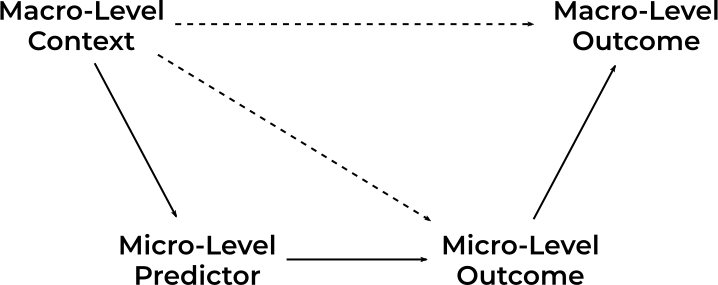
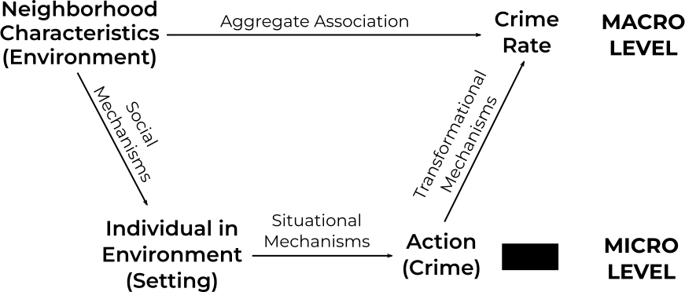
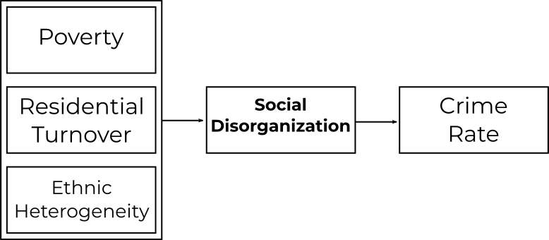
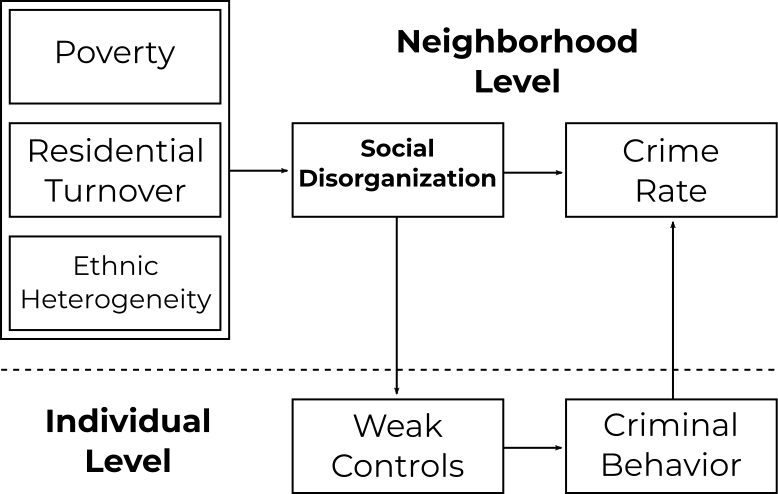
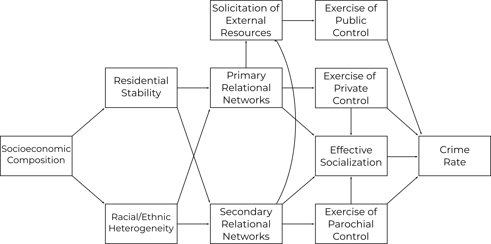
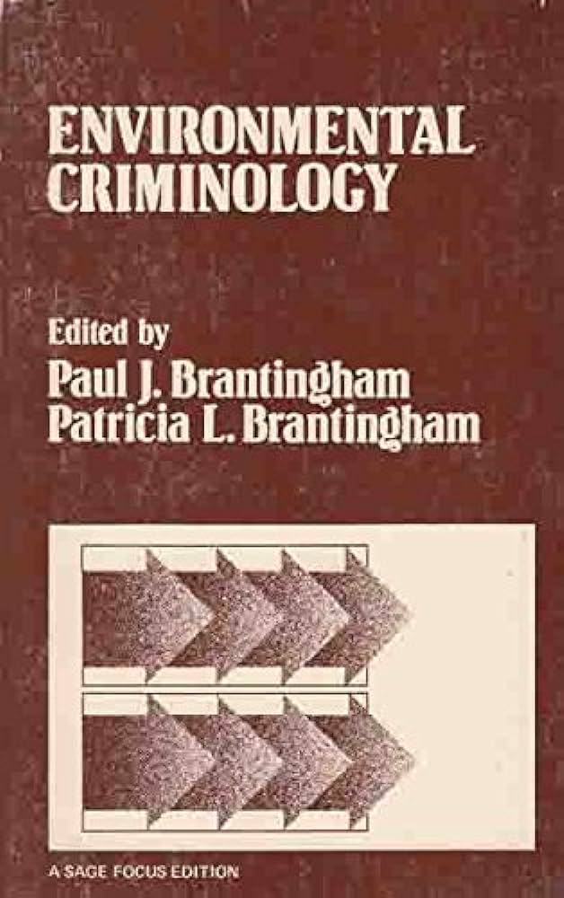
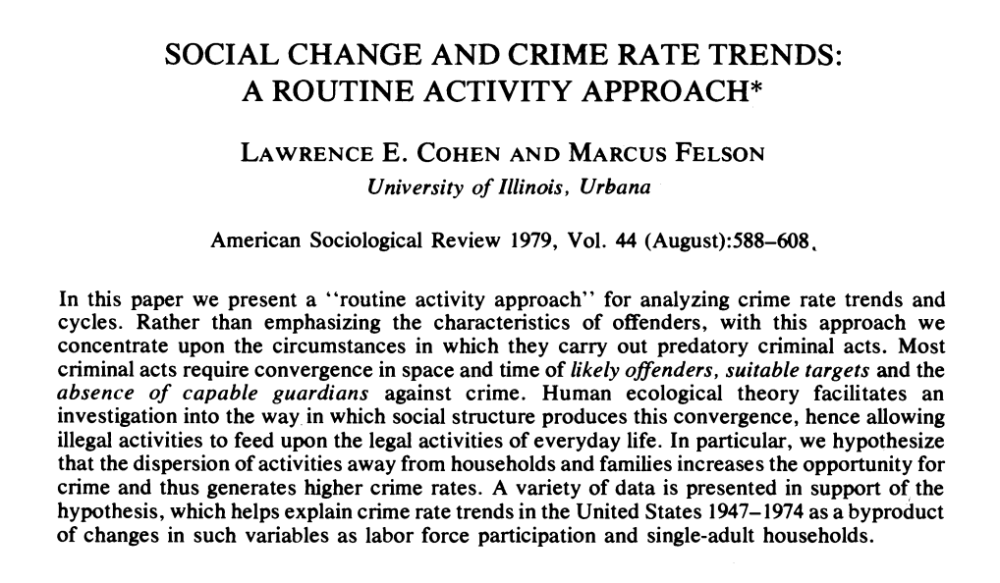
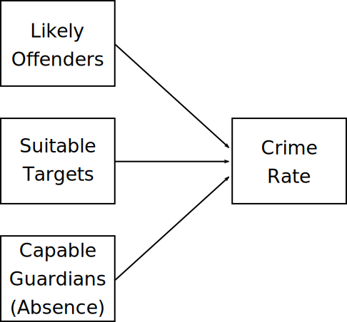
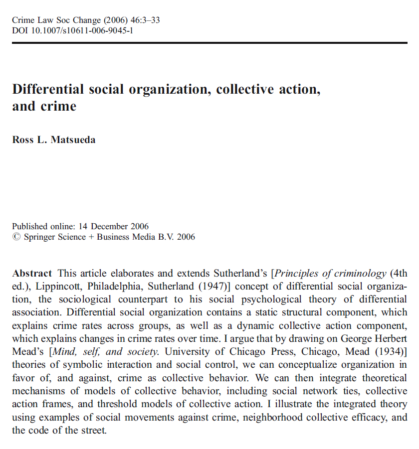
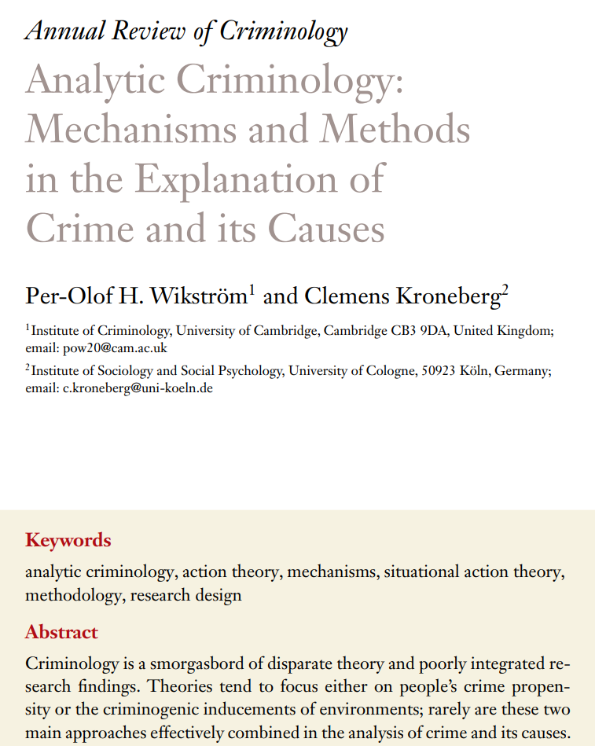

```{r setup, include = FALSE}
knitr::opts_chunk$set(echo=FALSE, warning = FALSE, message = FALSE, dev = "svg", fig.height = 5, dev.args=list(bg="transparent"))
```

# Overview

Social Ecology

Two ecological streams:

* Classic Crime Ecology
   * Social Disorganization
   * Collective Efficacy
* Environmental Criminology
   * Routine Activity

---
class: inverse
# Social Ecology

<br>

> the study of the social and behavioural outcomes of the interaction between man and his environment (Wikström 2007)

<br>

Basic principle: Characteristics of the environment explain variation in crime not attributable to individual characteristics alone

---
# The Environment

*Everything external to the individual with which they come into contact*

--

.pull-left[
**Physical**

* Natural environment
   * e.g., landscape, flora, fauna
* Ambient environment
   * e.g., light, temperature
* Built environment
   * e.g., structures and spaces
]

--

.pull-right[
**Social**

* Social structure
   * e.g., norms, cohesion
* Social activities
   * e.g., monitoring, interventions
* Presence of others
   * e.g., bonds, "eyes on the street"
]

--
Environmental concepts:

* **Setting**: The immediate environment an individual can perceive at a given moment
* **Activity field**: All the settings an individual experiences during some time of interest


---
# Boudon—Coleman Boat

Most ecological theories focus on environmental causes and aggregate outcomes (macro-level), but crime happens in situations (micro-level)

--

The **Coleman** boat or **Boudon-Coleman** boat is used to illustrate causal mechanisms (arrows) linking micro (e.g., individual) and macro (e.g., neighborhood) variables<br>



---
# Boudon—Coleman Boat

We can apply the boat to thinking about the role of the environment in causing crime:<br><br>




.text-center[

<br>*Micro-macro <strong>mechanisms</strong> are important for ecological theories*

]

---
# Two Streams


---
class: inverse

# Classical Crime Ecology

### Sociology's classic social control perspective

> In the most fundamental terms, "social control" referred to the capacity of a society to regulate itself according to desired principles and values. (Janowitz 1975:82)

---
# The Chicago School

Context at the start of the 20th century:

* Dominance of individualistic theories

   + Evolutionary and biological
   + Mental deficiency

--

* Neglect of changing conditions of life

   + Urbanization
   + Mass migration and immigration
   + Inner city poverty and despair (e.g. Sinclair's *The Jungle*)

---
# The Chicago School

A new approach to social science:

* Apply principles of natural ecology to urban processes

   + Competition among groups
   + Niches in "natural places"
   + Behaviour determined by social structure and environment, not genetics and traits

* Methodology

   + Ethnography
   + Ecological Analysis
   + The City as a Laboratory

---
# Social Disorganization


---
## Big Data + Mixed Methods

.pull-left-60[
* Court, truancy, and crime records

   + Spatial analysis of delinquent residences
      * *Location of **delinquents** not **crimes***
   + Sociodemographic data
   + Early network analysis

* Interviews with delinquents

   + Life histories
   + Self-perceptions
   + Roles of peers and older delinquents
]
.pull-right-40[

]

 
---
## Shaw & McKay's Observations

.pull-left-60[
* More delinquents in "zone in transition"

   + High **population turnover**, ethnic **heterogeneity**, and **poverty**
   + Age-spanning **delinquent tradition** competing with conventional values
   + Crime high and delinquent groups stable *despite ethnic turnover*

* Few delinquents in peripheral areas

   + Stable, homogeneous, middle and upper class population
   + Isolated delinquency; no delinquent tradition
   + Ethnic groups moving outward *exhibited low crime rates*
]
.pull-right-40[

]

--

.text-center[
*How do we make sense of this?*
]

---
## Social Disorganization Theory

**Social disorganization** is the inability of community to **solve problems collectively** or **achieve collective values**

* Produces myriad social ills including delinquency
* Theory of **delinquents** rather than **delinquent acts**

<br>


---
count: false
## Social Disorganization

* Weak and unlinked institutions with no sense of community

   + Family structure
   + Schools
   + Community groups

--

* Measures used by Shaw & McKay

   + Population loss
   + Proportion rentals vs. owned homes
   + Income
   + Physical deterioration
   + Percentage nonwhite


---
## Causes

* Poor economic conditions

   + Reduced conventional opportunities
   + Lack of resources to address problems
   + Reliance on illegal or quasi-legal income

--


* Residential Instability

   + Constant disruption of institutions
   + Impermanence reduces sense of community

--


* Ethnic/Racial Heterogeneity

   + Different norms and values (or at least perception of such)
   + Communication barriers
   + Shift to urban living

---
## **Place** not race!

*Racial differences in delinquency are due primarily to location of residence.*

> ... it cannot be said that [black delinquency rates] are higher than rates for white boys in comparable areas, since it is impossible to reproduce in white communities the circumstances under which Negro children live... it would not be possible to reproduce the effects of segregation and the barriers to upward mobility. (xxix)

<br>

> Clearly, one must beware of attaching social and economic significance to race or nativity. For, in the present social and economic system, it is the Negroes and the foreign born, or at least the newest immigrants, who have least access to the necessities of life and who are therefore least prepared for the competitive struggle. It is they who are forced to live in the worst slum areas and who are least able to organize against the effects of such living. (155)

---
## Social Disorganization Theory

<br>


 

---
## Mechanisms

*Rich social explanation derived from court records and life histories*

.pull-left[
**Loss of Control Over Youth**

* *The direct effect of social disorganization on delinquency*
* Loss of informal social control

    + Parental supervision
    + Community controls

* Spontaneous, unsupervised play groups of children
]

--

.pull-right[
**Cultural Transmission**

* *The indirect effect of social disorganization on delinquency*
* Delinquent tradition transmitted across generations of youth

   * Older gangs transmit delinquency to younger play groups
   * Transmission is **learning** of a culture

* Delinquent traditions make high delinquency rate persistent 
]


---
# Kornhauser's Critique

* **No evidence for delinquent subcultures**

   * Conventional norms, just weakly bound

--

* Delinquent subculture *incompatible* with social disorganization

   * Delinquent subculture can't exist without disorganization
   * Disorganization produces delinquency absent subculture=

--

* Recast social disorganization using Hirschi's **social control**

   * **Disorganization impedes internal and external controls**
      * Controls derived from stable, interconnected institutions
      * Generates both criminals (propensity) and crime (situational actions)
   * Led to revitalisation of social disorganisation
      * e.g., Sampson & Groves (1989)

---
## Kornhauser's Social Disorganization

<br>

.image-75[

]

---
## Implicit Multilevel Model

<br>

.image-75[

]


---

# The Systemic Model

* Bursik & Grasmick (1993)
   * Social control doesn't need universal norms
   * Control is about preventing behavior that interferes with *group goals*
      * *Residents share goal of freedom from threat of crime.*

--

Network connections key to coordinate levels of control:

* **Private**: Family / friends (Informal control)
* **Parochial**: Community (Informal control)
* **Public**: Government (Formal control)

.text-center[
*High crime rates result from disarticulation between levels*
]

---
## Systemic Social Disorganization

<br>




.text-center[
*Socialization, informal, and formal control working together as a system*
]

.footnote[Adapted from Bursik & Grasmick (1993:39)]

---
class: inverse
# Collective Efficacy

.pull-left[
.image-full[

]
]

.pull-right[
.image-full[

]
]

---
## Collective Efficacy

"The linkage of mutual trust and the willingness to intervene for the common good" (Sampson)


* Merges control-based social disorganization, systemic model, and social capital theories

* A neighborhood **capacity to achieve an intended effect**

   * e.g., maintaining public order
   * Mechanisms: 
      * Primary: Social control actions—informal *and* formal
      * Secondary: Socialisation

--

* Collective efficacy inhibited by...

   * **Heterogeneity** through realization of common values
   * **Disadvantage** through deprivation of resources
   * **Residential instability** through disruption of social ties

---
## Collective Efficacy and Crime

<br>

.image-90[

]

---

### Collective efficacy vs. social disorganization

>  ‘[Collective efficacy] accepts the basic idea of Social
Disorganization theory that social control is a collective
challenge not attributable to the characteristics of individuals
alone and that it constitutes a major source of variation in
crime rates (Sampson 2012)

&nbsp;

> ‘[Collective efficacy] relaxe[s] the traditional
disorganization assumption that the ideal contextual setting for
social control is necessarily one characterized by dense,
intimate, and strong neighbourhood ties (e.g., through friends
or kin) (Sampson 2012)

&nbsp;

Another key difference: *Focus on control of crime rather than criminality*

---
## Status

.pull-left[
.image-100[

]
]
.pull-right[

&zwj;Evidence:

* Support in USA and internationally
* Stronger in cross-section than longitudinal

&zwj;Future work:

* Mechanisms
   * Developmental
   * Situational
* Interventions
]

---
class: inverse

# Environmental Criminology

### Criminology's opportunity perspective



---
# Context

Through 1970s, most theories of crime focused on individual characteristics, socialization, and social structures

* Motivation and decision-making
* Social learning
* Subcultural theories
* Social organization of neighborhoods

--

These explained cross-sectional variation between individuals and groups well

They explained *changes* in national, area, and place crime rates poorly

--

The insight: *Offenders are only part of the story*

* Regardless of motivation, crime requires an **opportunity**
* Variation in opportunity may matter more than variation in motivation

---
# Situational Opportunity

Multiple opportunity perspectives emerged in and after 1970s

Levels of explanation varied:

* Nations, cities, communities
   * Cohen & Felson's *Routine Activity Theory*
* Street segments
   * Weisburd et al.'s *Criminology of Place*
* Individual properties
   * Jeffery & Newman's *Crime Prevention Through Environmental Design* (CPTED)
   * Eck's *Place Management Theory*

--

Later developments linked these ideas into multi-level theories, e.g.:

* Clarke & Felson, Wilcox & Cullen: Routine activity + rational choice
* Brantigham & Brantingham: Crime pattern theory

--

.text-center[
*We'll focus on the most influential: **Routine activity***
]

---
class: inverse
# Routine Activity Theory

<br>



---
## Opportunity

Explicitly ecological: Offending as *predators* feeding on society

---
count:false
## Cohen & Felson 1979

<br>

> The
 interdependence between offenders and
 victims can be viewed as a predatory relationship between functionally dissimilar
 individuals or groups. Since predatory
 violations fail to yield any net gain in
 sustenance for the larger community, they
 can only be sustained by feeding upon
 other activities

<br>

> Since illegal activities must feed upon other
activities, the spatial and temporal structure of
routine legal activities should play an important role
in determining the location, type and quantity of
illegal acts occurring in any given community

---
count:false
## Opportunity

Explicitly ecological: Offending as *predators* feeding on society

Predatory crimes *require* criminogenic *situations*—convergences of...


--

1. Likely offenders
--

2. Suitable targets
--

3. Absence of capable guardians

--

*Aggregate* changes in these explain crime rates

*Social and technological changes in **routine behaviour** can produce drastic changes in crime*, e.g.:


--

* More high-value portable goods or conspicuous consumption
* Less time spent at home, more at night and at drinking venues
* Dual income households—less supervision of home, neighborhood, and children

---
## Routine Activity Theory

.image-full[

]

.footnote[Note this is *multiplicative*: No crime if any one component is missing!]

---
## Criticism

*Absence* of micro-theory<sup>1</sup>

* Goal to "see how far you can go" without engaging with motivation
* No attention to motivation for offender *or* guardian
* *Suggests* importance of opportunities to micro-level 

.footnote[
[1] It is often combined with rational choice to form a multi-level theory, e.g., Clarke & Felson (1993)
]

---
## Wikström & Treiber (2015)

> Arguing that if someone is motivated to commit a crime and
faces a suitable target lacking adequate guardianship, he or
she will commit an act of crime does not take us very far
towards understanding what causes that crime, or the role of
the environment. For example, it does not explain why some
people, but not others, commit an act of crime in response to
(particular) suitable targets lacking guardianship; why some
targets are suitable to some people, but not others; or why
some forms of guardianship, but not others, influence some
people’s , but not others’, crime

---
count:false

## Criticism

*Absence* of micro-theory<sup>1</sup>

* Goal to "see how far you can go" without engaging with motivation
* No attention to motivation for offender *or* guardian
* *Suggests* importance of opportunities to micro-level 

.footnote[
[1] It is often combined with rational choice to form a multi-level theory, e.g., Clarke & Felson (1993)
]

Convergence mechanism is non-falsifiable

* If a crime occurred, there *must* have been a convergence
   * e.g., anyone present wasn't a "capable guardian"
* If a crime did not, then maybe there was no convergence
   * e.g., someone was not actually a "likely offender"

--

.text-center[
*Still, it is parsimonious and useful for thinking about crime rates*
]


---
class: inverse
# Moving Forward

---
# Mechanisms

Ecological theories have largely failed to specify:

* **Situational mechanisms**

   * When, why, and for whom do environmental features influence action?

--

* **Developmental mechanisms**

   * How do environments change crime-relevant characteristics of individuals?

--

* **Transformational mechanisms**

   * How do criminogenic environments emerge?

--

* **Selection mechanisms**

   * When, why, and who selects into criminogenic environments?

---
# The Boat

&nbsp;


---
# Micro-Macro Approaches

.pull-left[

]
.pull-right[

]

---
class: inverse
# Summary

* Social ecological theories focus on human-environment interaction

* Sociological perspective emphasises social control and socialisation

* Criminological perspective emphasises opportunity

* Micro-macro mechanisms are theoretical and empirical frontier 
